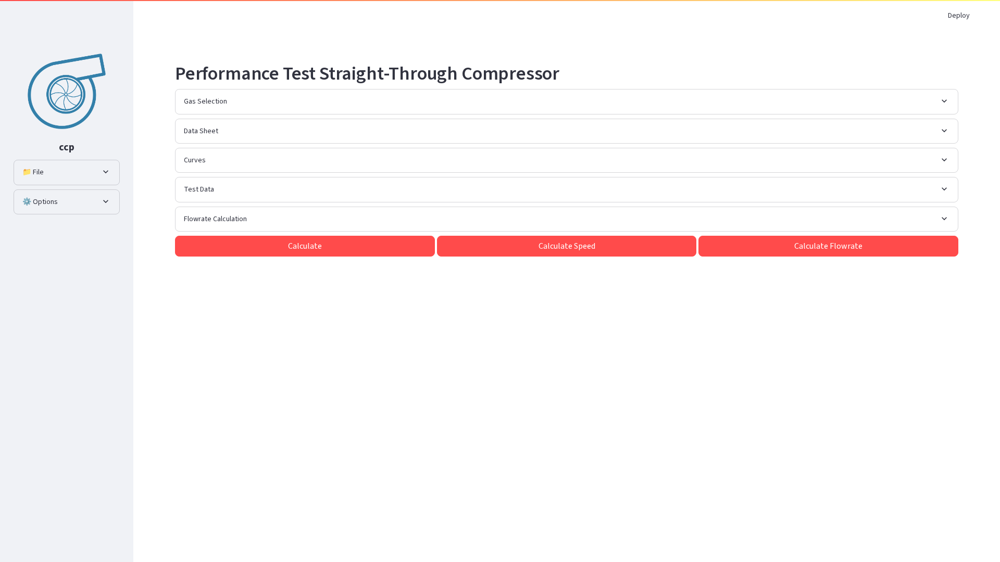
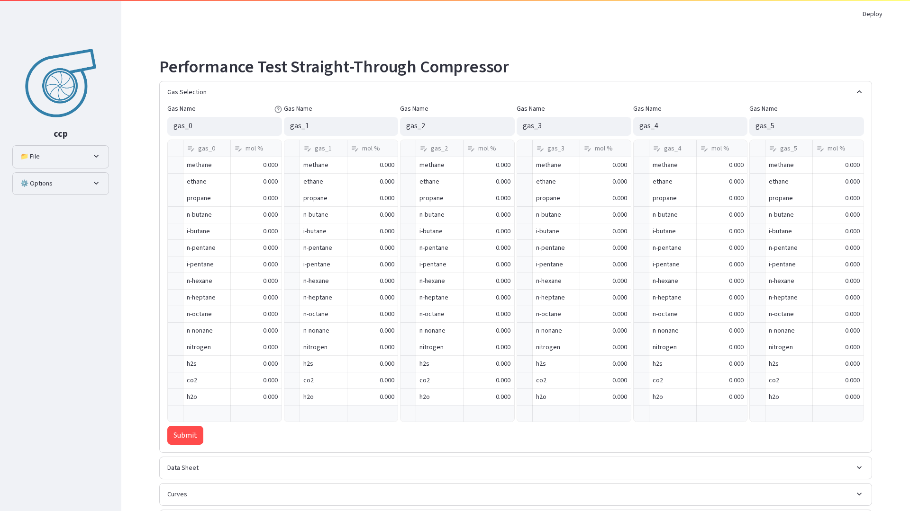
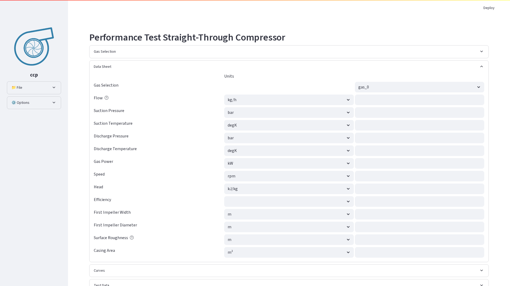
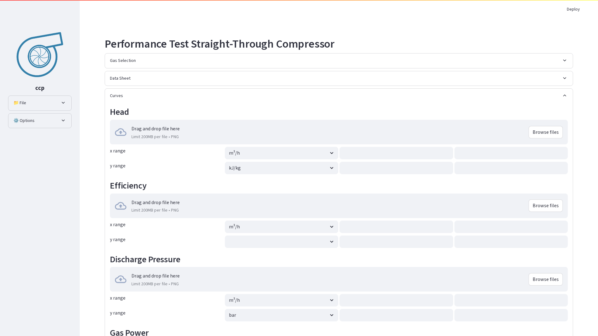
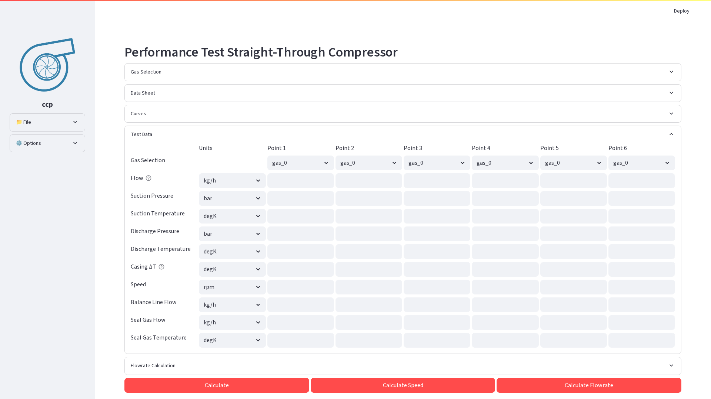
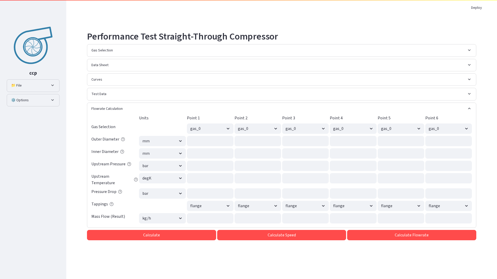

# CCP Straight-Through Compressor User Guide

## Table of Contents
1. [Overview](#overview)
2. [Getting Started](#getting-started)
3. [Interface Layout](#interface-layout)
4. [Gas Selection](#gas-selection)
5. [Data Sheet Configuration](#data-sheet-configuration)
6. [Performance Curves](#performance-curves)
7. [Test Data Input](#test-data-input)
8. [Flowrate Calculation](#flowrate-calculation)
9. [Running Calculations](#running-calculations)
10. [Understanding Results](#understanding-results)
11. [File Management](#file-management)
12. [Advanced Options](#advanced-options)
13. [Troubleshooting](#troubleshooting)
14. [Example Workflow](#example-workflow)

## Overview

The Straight-Through Compressor page in the CCP application is designed for performance testing and analysis of straight-through centrifugal compressors according to ASME PTC 10 standards. 

### Key Features
- **Multi-gas support**: Define up to 6 different gas compositions
- **Automatic flow calculation**: Using orifice plate measurements
- **Variable speed analysis**: Calculate optimal speed to match discharge pressure
- **Performance curve visualization**: Interactive plots with customizable ranges
- **Data persistence**: Save and load complete session states

## Getting Started

### Accessing the Application

1. Navigate to the CCP application URL
2. Select **"1_straight_through"** from the sidebar menu
3. The main interface will load with expandable sections for data input

### Initial Setup

When starting a new analysis, follow these steps in order:

1. Define gas compositions
2. Enter guarantee point data (Data Sheet)
3. Upload or define performance curves
4. Input test data
5. Configure flowrate calculation (if needed)
6. Run calculations

## Interface Layout

The Straight-Through page consists of several sections:

*Main interface showing the expandable sections and sidebar options*

### Sidebar Components

#### File Management
- **Session name**: Identify your work session
- **Open File**: Load previously saved `.ccp` files
- **Save/Save As**: Export current session

#### Options Panel
- **Reynolds Correction**: Enable/disable Reynolds number corrections
- **Casing Heat Loss**: Account for heat losses through casing
- **Calculate Leakages**: Include leakage calculations
- **Seal Gas Flow**: Enable seal gas flow inputs
- **Variable Speed**: Allow speed variations in calculations
- **Show Points**: Display individual test points on curves
- **Ambient Pressure**: Set reference pressure for gauge measurements

### Main Content Area

The main area contains expandable sections for different aspects of the analysis:

1. **Gas Selection**: Define gas compositions
2. **Data Sheet**: Enter guarantee point specifications
3. **Curves**: Upload or define performance curves
4. **Test Data**: Input actual test measurements
5. **Flowrate Calculation**: Calculate flow using orifice measurements
6. **Results**: View calculation outputs and plots

## Gas Selection

### Defining Gas Compositions

The Gas Selection section allows you to define up to 6 different gas compositions that can be used throughout the analysis.

#### For each gas:

1. **Gas Name**: Enter a descriptive name (e.g., "gas_0", "Natural Gas Mix 1")
2. **Component Table**: 
   - Select components from the dropdown (methane, ethane, etc.)
   - Enter molar fractions (mol %)
   - Add/remove rows as needed
   - Total should sum to 100%

*Gas Selection section expanded, showing gas composition definition interface with component tables*

## Data Sheet Configuration

The Data Sheet section is where you enter the guarantee point specifications from the compressor data sheet.

### Required Parameters:

#### Flow Parameters
- **Flow**: Mass flow (kg/s) or volumetric flow (m³/h)
- **Units selection**: Choose appropriate units from dropdown

#### Pressure Parameters
- **Suction Pressure**: Inlet pressure
- **Discharge Pressure**: Outlet pressure
- Units: bar, bara, barg, Pa, kPa, MPa, psi, psia

#### Temperature Parameters
- **Suction Temperature**: Inlet temperature
- **Discharge Temperature**: Outlet temperature
- Units: K, °C, °F, °R

#### Performance Parameters
- **Power**: Shaft power requirement
- **Speed**: Rotational speed
- **Head**: Polytropic/isentropic head
- **Efficiency**: Polytropic efficiency

#### Geometric Parameters
- **b (Impeller exit width)**: Exit width dimension
- **D (Impeller diameter)**: Impeller outer diameter
- **Surface roughness**: Internal surface roughness
- **Casing area**: Cross-sectional area for heat transfer

### Input Guidelines:
1. Select the gas composition for the guarantee point
2. Choose consistent unit systems
3. Enter all required values before proceeding
4. Verify values against original data sheets
5. Use the help icons (?) for parameter descriptions

*Data Sheet section showing guarantee point parameters including flow, pressure, temperature, and performance specifications*

## Performance Curves

### Uploading Curve Images

The Curves section allows you to upload performance curve images and define axis ranges for proper scaling.

#### For each curve type:
1. **Head Curve**
2. **Efficiency Curve**
3. **Discharge Pressure Curve**
4. **Power Curve**

#### Steps to Configure:
1. Click "Choose File" to upload PNG image of the curve
2. Define X-axis (flow) range:
   - Lower limit
   - Upper limit
   - Units selection
3. Define Y-axis range:
   - Lower limit
   - Upper limit
   - Units selection (specific to curve type)

### Axis Configuration Tips:
- Match units to your data sheet values
- Set ranges equal to the plot ranges
- Images will overlay on calculated curves for comparison

*Curves section displaying uploaded performance curve images with axis range configuration options*

## Test Data Input

### Entering Test Points

The Test Data section accommodates up to 6 test points for performance evaluation.

#### For Each Test Point:

##### Required Measurements:
- **Gas Selection**: Choose from defined gases
- **Flow**: Actual measured flow
- **Suction Pressure**: Measured inlet pressure
- **Suction Temperature**: Measured inlet temperature
- **Discharge Pressure**: Measured outlet pressure
- **Discharge Temperature**: Measured outlet temperature
- **Speed**: Actual rotational speed

##### Optional Measurements:
- **Casing Delta T**: Temperature difference for heat loss calculation
- **Balance Line Flow**: Leakage flow through balance line
- **Seal Gas Flow**: Flow rate of seal gas (if enabled)
- **Seal Gas Temperature**: Temperature of seal gas

*Test Data section showing multiple test points with measured parameters for performance evaluation*

## Flowrate Calculation

### Using Orifice Plate Measurements

When direct flow measurement is unavailable, the Flowrate Calculation section computes flow using orifice plate differential pressure measurements.

#### Required Parameters for Each Point:

##### Orifice Geometry:
- **Outer Diameter (D)**: Pipe inner diameter
- **Inner Diameter (d)**: Orifice bore diameter

##### Process Conditions:
- **Upstream Pressure**: Pressure before orifice
- **Upstream Temperature**: Temperature before orifice
- **Pressure Drop**: Differential pressure across orifice

##### Configuration:
- **Tappings Type**: 
  - Flange taps
  - Corner taps
  - D and D/2 taps
- **Gas Selection**: Choose gas composition

### Calculation Process:
1. Enter all orifice parameters
2. Click "Calculate Flowrate" button
3. Calculated mass flow appears in the last row

*Flowrate Calculation section with orifice plate parameters and differential pressure measurements for flow computation*

## Running Calculations

### Calculation Options

Three calculation modes are available:

#### 1. Standard Calculate
- **Purpose**: Analyze performance at data sheet speed
- **Process**: 
  - Converts test points to guarantee conditions
  - Applies Reynolds corrections
  - Generates performance comparison

#### 2. Calculate Speed
- **Purpose**: Find speed to match discharge pressure
- **Process**:
  - Iteratively adjusts speed
  - Matches test discharge pressure to guarantee
  - Useful for variable speed drives

### Execution Steps:
1. Verify all required data is entered
2. Select appropriate calculation mode
3. Click the corresponding button
4. Monitor progress bar
5. Review warnings/errors if any
6. Examine results section

## Understanding Results

### Results Table

The results section displays a comprehensive comparison table with the following parameters:

#### Flow Coefficients:
- **φt**: Test flow coefficient
- **φt/φsp**: Ratio to guarantee point

#### Volume Ratios:
- **vi/vd**: Volume ratio
- **(vi/vd)t/(vi/vd)sp**: Volume ratio comparison

#### Similarity Parameters:
- **Macht**: Test Mach number
- **Macht - Machsp**: Mach number difference
- **Ret**: Test Reynolds number
- **Ret/Resp**: Reynolds number ratio

#### Performance Parameters:
- **pdconv**: Converted discharge pressure
- **Headconv**: Converted head
- **Qconv**: Converted flow rate
- **Wconv**: Converted power
- **Effconv**: Converted efficiency

### Color Coding:
- **Green highlight**: Within acceptable limits
- **Red highlight**: Outside acceptable limits

### Acceptance Criteria:
- Mach difference: ±0.05
- Reynolds ratio: 0.95-1.05
- Volume ratio: 0.95-1.05
- Power ratio: <1.04 (variable speed) or <1.07 (fixed speed)

*[Screenshot placeholder: Results table with color-coded values]*

### Performance Plots

Four interactive plots visualize the performance:

#### 1. Head vs Flow
- Shows test curve and guarantee point
- Converted performance curve
- Interactive zoom and pan

#### 2. Efficiency vs Flow
- Polytropic efficiency curve
- Test points and interpolation
- Guarantee point marker

#### 3. Discharge Pressure vs Flow
- Pressure rise characteristics
- Operating point indication
- Background curve image (if uploaded)

#### 4. Power vs Flow
- Shaft power requirements
- Speed-corrected values
- Power limit indicators

### Plot Features:
- **Interactive**: Zoom, pan, hover for values
- **Legends**: Click to show/hide traces
- **Export**: Save as PNG or SVG
- **Background**: Original curves overlay

*[Screenshot placeholder: Four performance plots arranged in grid]*

### Additional Visualizations

#### Mach Number Plot
- Shows Mach number variation
- Acceptable range indication
- Critical Mach limit

#### Reynolds Number Plot
- Reynolds number comparison
- Correction factor visualization
- Valid range highlighting

## File Management

### Saving Sessions

#### Save Current Work:
1. Enter session name in sidebar
2. Click "Save" button
3. File saves as `[session_name].ccp`

#### Save As:
1. Click "Save As" button
2. Download dialog appears
3. Choose location and filename

### Session File Contents:
- All entered data
- Gas compositions
- Uploaded curves
- Calculation results
- Plot configurations

### Loading Sessions

#### Open Saved File:
1. Click "Open File" in sidebar
2. Select `.ccp` file
3. Click "Load" button
4. All data restores automatically

### File Format:
- Compressed ZIP archive
- Contains JSON data and images
- Version controlled for compatibility
- Portable between installations

## Example Workflow

You can find some example files inside ccp/app folder.
